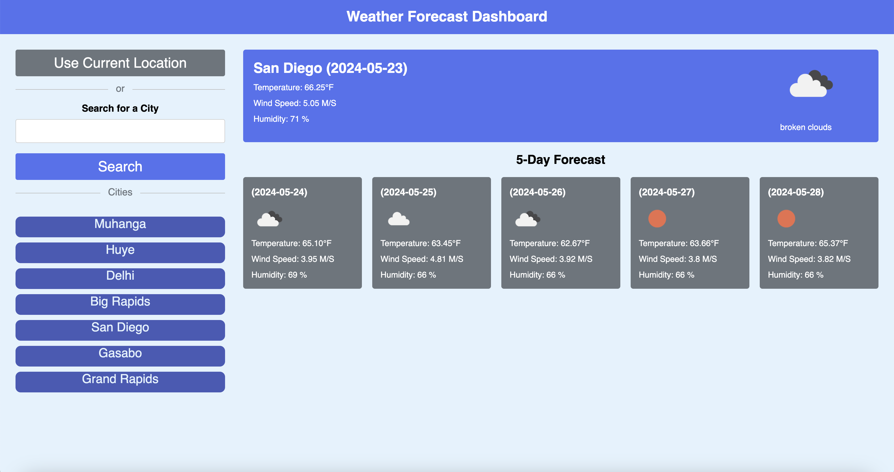

# Weather-Forecast-Blog
## Description
```md 
Sometimes people plan they journey based on weather. As developer I want to come up with a Weather Forecast Blog which could help traveler to first check for the city they want to visit and know the weather for the current date and so five days ahead.
```

## Installation
```md
This Web Application will be hosted 
and will not require any installation. 
The clients will require to have a digital device 
that have a browser such as google Chrome, 
Mozilla firefox and so on.

```
## User Story

```md
AS A traveler
I WANT to see the weather outlook for multiple cities
SO THAT I can plan a trip accordingly
```

## Usage
To use this website you are:
* GIVEN a weather dashboard with form inputs
* WHEN I search for a city
* THEN I am presented with current and future conditions for that city and that city is added to the search history
* WHEN I view current weather conditions for that city
* THEN I am presented with the city name, the date, an icon representation of weather conditions, the temperature, the humidity, and the wind speed
* WHEN I view future weather conditions for that city
* THEN I am presented with a 5-day forecast that displays the date, an icon representation of weather conditions, the temperature, the wind speed, and the humidity
* WHEN I click on a city in the search history
* THEN I am again presented with current and future conditions for that city
* THEN the saved tasks persist
* WHEN I Click on Current Location Button, THEN I am presented with the city name, the date, an icon representation of weather conditions, the temperature, the humidity, and the wind speed for the current location. (It may delays for some seconds in order to load for the current location)

## Mock-Up

The following images show the web application's appearance and functionality:

The image below shows the weather app includes a search option, a list of cities, and a five-day forecast and current weather conditions for San Diego




## Link of Deployed Application
 Link: [`Weather Forecast Blog`](https://jahdona.github.io/Weather-Forecast-Blog/)

## Credits

N/A

## License

This website uses the license of MTI